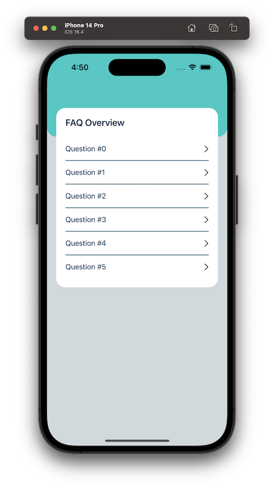
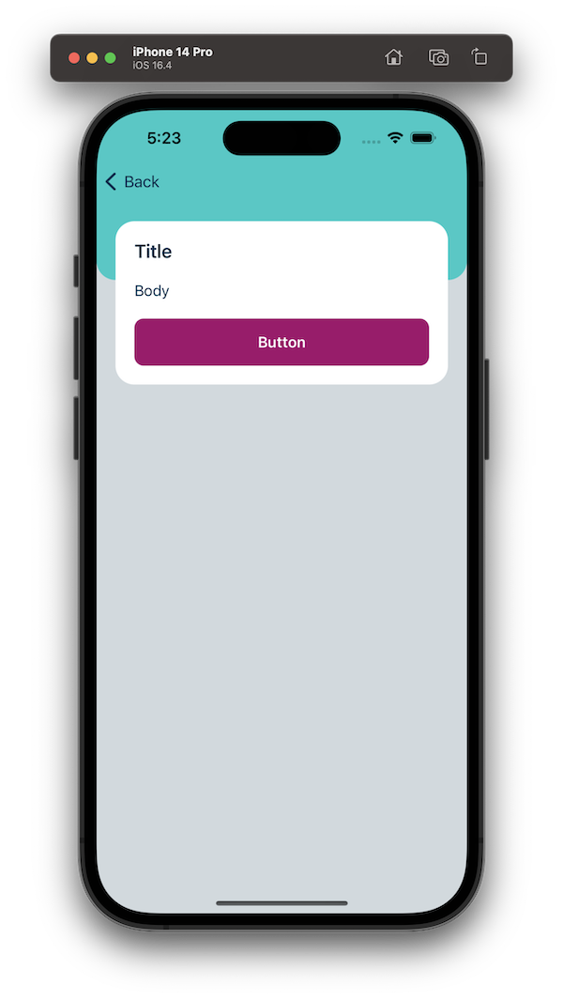
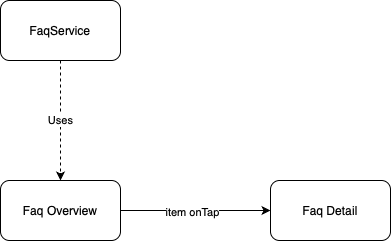

# Assignment

---
## Process

- Start this assignment by forking this Git Repo
- Use git, meaning incremental commit your solution
- When you are done create a Pull request

After that we will be reviewing your pull request based on the following points:

- The overal code quality
- Future proofness of your implementation
- Code smells
- Used design patterns
- If the commit messages matches the commit
- How the code evolves over the commits
- Warnings, Crashes & Potential Memory Leaks

You are not allowed to:

- Modify any code in the Service module
- Add Swift packages
- Modify the swiftlint rules


---
## Description

In this assignment we are going to implement an overal app architecture and a FAQ contentparser.

The contentparser should support the following types:

- title
- body
- button


---
## Design

| Screen | Example |
| --- | --- |
| FAQ Overview |  |
| FAQ Detail |  |


---
## Content

**Overview screen**

| Type | Description |
| --- | --- |
| screen title | Static "FAQ Overview" |
| row text | dynamic, the `text` of the first element where `type == "title"`

**Detail screen**

| Type | Description |
| --- | --- |
| content | dynamic, all text for all elements should be presented on the screen


---
## Flow



---
## Scope

**In Scope**

- Implement a futureproof app architecture (like MVVM, Viper, etc)
- Fetch the FAQ Data and display it (as described under `content`) in the Overview and Detail screen
- Present a retry button if fetching the FAQ Data fails

**Out of Scope**

- Data parsing, this has already been done for you in the FaqService


---
## Implementation specifics

**Fetch Data**

```swift:
try await FaqService().fetch()
```

**Where type is title**

```swift:
UILabel(text: "Content").title()
```

**Where type is text**

```swift:
UILabel(text: "Content").body()
```

**Where type is button**

```swift:
UIButton(text: "Content").primary {
	/* open url */
}
```

---
# Data

**Where type is title**

```json:
{
    "type": "title",
    "text": "How is a dictionary different from an array?"
}
```

**where type is body**

```json:
{
    "type": "body",
    "text": "Suggested approach: It’s all down to how you access data: arrays must be accessed using the index of each element, whereas dictionaries can be accessed using something you define – strings are very common. Make sure and give practical examples of where each would be used."
}
```

**Where type is button**

```json:
{
    "type": "button",
    "text": "More information",
    "action": "https://developer.apple.com/documentation/swift/dictionary"
}
```